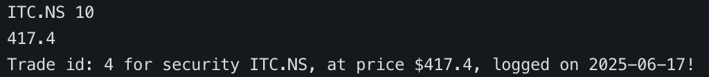
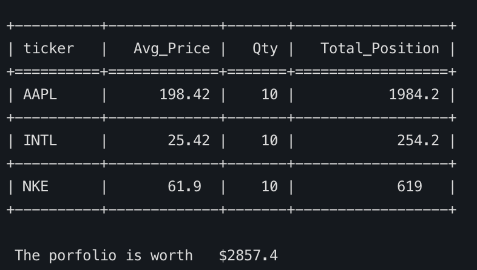

# 📊 Portfolio Viewer

A simple command-line tool to add, view, and manage your stock portfolio using a local *SQLite* database.

---

This project was created by **Harsh Malik** as his submission for the **CS50 Final Project**.

💡 *Prices are <ins>automatically fetched</ins> from [Yahoo Finance](https://finance.yahoo.com/).*

---

## ✨ Features

1. Add a stock to your portfolio with quantity — the price is auto-fetched  
2. View the current portfolio in a clean table using `tabulate`  
3. Track gains/losses from your investment date *(coming soon)*  
4. Exit via command-line argument  
5. Display the last price refresh timestamp *(planned)*

---

## 🛠 Commands

Run the tool with:

```bash
python portfolio_tool.py [options]

| Flag          | Description                                   |
| ------------- | --------------------------------------------- |
| `-s`          | View your current portfolio summary           |
| `-a TICKER`   | Add a stock (e.g., `AAPL`, `TSLA`, `INFY.NS`) |
| `-q QUANTITY` | Quantity to add (must be used with `-a`)      |
| `-p TICKER`   | Show the current price of a stock             |
| `-e`          | Exit the program                              |

```
## Usage
```bash 
python portfolio_tool.py -a AAPL -q 10
```


```bash 
python portfolio_tool.py -s
```


## 📁 Data Storage
All your portfolio data is stored in a local <ins>SQLite</ins> database: portfolio.db